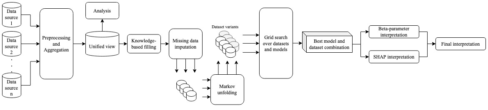
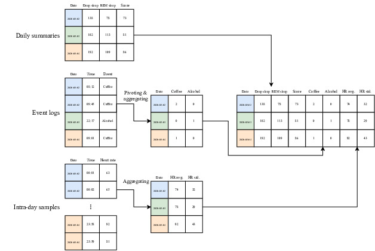
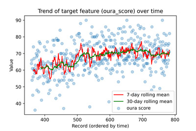
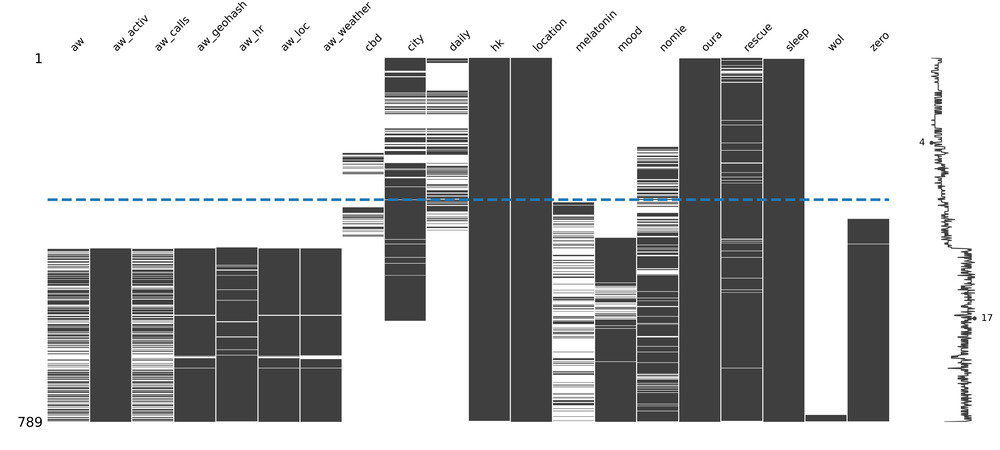
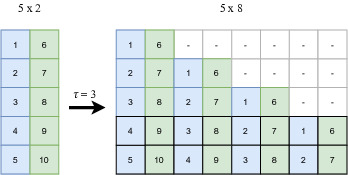
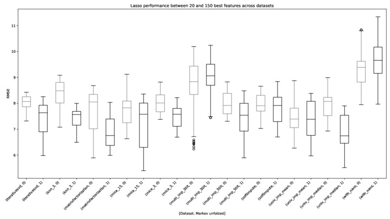
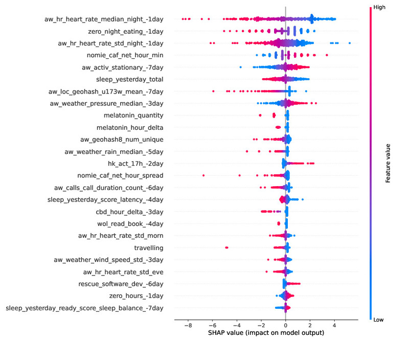

# Quantified Sleep

An exploration of techniques for observational n-of-1 studies.

## Overview

This project combined techniques from across disciplines and applied them in an observational n-of-1 Quantified-Self (QS) study to build a descriptive model of sleep quality. A total of 472 days of my sleep data, collected nightly with an Oura ring, were combined with a variety of lifestyle, environmental, and psychological data harvested from multiple sensors and manual logs.

Observational n-of-1 QS projects pose a number of specific challenges: heterogeneous data sources with many missing values; few observations and many features, resulting in overparameterised models; and systems composed of dynamic feedback loops that exacerbate human biases. This project addressed these problems through two main contributions: 

1. An end-to-end QS pipeline for observational studies
2. A wide-ranging exploration of complementary techniques for overcoming each of the challenges of n-of-1 QS projects

Sleep quality is one of the most challenging modelling targets in QS research, due to high noise and a high number of weakly-contributing factors, meaning that approaches from this project should generalise to most other n-of-1 QS projects. 

### Data wrangling

In `01_wrangling.ipynb`, techniques are presented for combining heterogeneous data sources and engineering day-level features from different data types and frequencies, including manually-tracked event logs and automatically-sampled weather and geo-spatial data. 

### Statistical analyses

In `02_analysis.ipynb`, relevant statistical analyses for outliers, normality, (auto)correlations, stationarity, and missing data are detailed, along with a proposed method for hierarchical clustering to identify correlated groups of features.

### Missing data imputation

In `03_imputation.ipynb`, the missing data was overcome using a combination of knowledge-based and statistical techniques, including several multivariate imputation algorithms. 

### Collapsing time series to i.i.d.

"Markov unfolding" was used as a technique for collapsing the time series into a collection of independent observations for modelling, thus incorporating historical data. 

### Comparing algorithms and preprocessing techniques

From the extensive grid-search (`04_grid_search.py`), a low-error, low-variance model and dataset combination was selected for the final modelling --- Lasso regression on a Markov-unfolded version of the dataset which had undergone matrix factorisation imputation.

In `05_results.ipynb`, the grid search was analysed. Regularised linear algorithms (Lasso and Ridge) performed the best with imputed data, particularly for the matrix factorisation, KNN, MICE, iterative SVD, and univariate imputation strategies. The use of imputation saved hundreds of observations from being discarded and improved overall performance of all the algorithms except the plain Decision Tree. Markov unfolding improved the predictive performance of Lasso dramatically, but for other algorithms the improvement was negligible. This was likely because the benefit of the additional information traded off against the added burden of much higher dimensionality.

### Model interpretation

In `06_interpretation.ipynb`, the final model was interpreted in two key ways: by inspecting the internal beta-parameters, and using the SHAP framework, which works on any "black box" model. These two interpretation techniques were combined to produce a list of the 16 most-predictive features.

By combining contemporary techniques, this project identified the factors that most-impact my sleep, demonstrating that an _observational_ study can greatly narrow down the number of features that need to be considered in interventional n-of-1 QS research.

