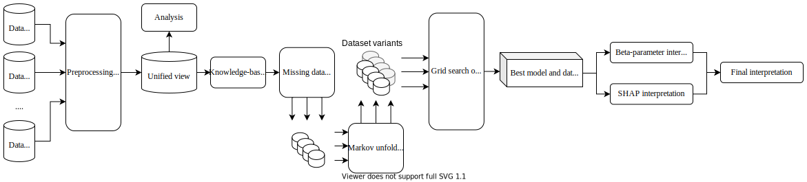
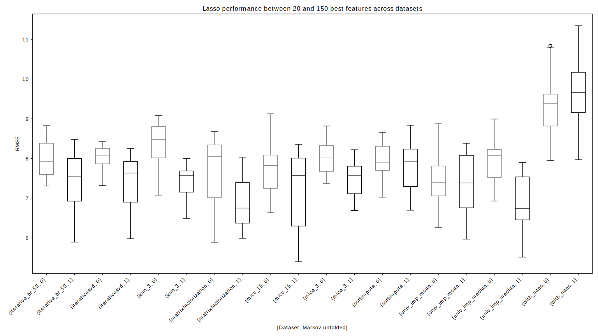

# Quantified Sleep

*Machine learning techniques for observational n-of-1 studies*

---

Read [the full paper here](https://drive.google.com/file/d/1BmAORUmRhqVx_BOM9S_ln9NTv6uJg5oN/view?usp=sharing).

## Abstract

This project applied statistical learning techniques to an observational Quantified-Self (QS) study to build a descriptive model of sleep quality. A total of 472 days of my sleep data was collected with an Oura ring. This was combined with a variety of lifestyle, environmental, and psychological data, harvested from multiple sensors and manual logs. 

By combining contemporary techniques, this project identified the factors that most affect my sleep, demonstrating that an _observational_ study can greatly narrow down the number of features that need to be considered when designing interventional n-of-1 studies.

### Challenges

Observational n-of-1 QS projects pose a number of specific challenges: 

* Heterogeneous data sources with many missing values.
* Few observations and many features, resulting in overparameterised models.
* Systems composed of dynamic feedback loops that exacerbate human biases. 

This project directly addresses these challenges with an end-to-end QS pipeline for observational studies. It combines techniques from statistics and machine learning to produce robust descriptive models. 

Sleep quality is one of the most challenging modelling targets in QS research, due to high noise and a high number of weakly-contributing factors, meaning that approaches from this project should generalise to most other n-of-1 QS projects. 

### Data wrangling

In `01_wrangling.ipynb`, techniques are presented for combining and engineering features for the different classes of data types, sample frequencies, and schema. This includes manually-tracked event logs and automatically-sampled weather and geo-spatial data. 

### Statistical analyses

In `02_analysis.ipynb`, relevant statistical analyses for outliers, normality, (auto)correlations, stationarity, and missing data are detailed, along with a proposed method for hierarchical clustering to identify correlated groups of features.

### Missing data imputation

In `03_imputation.ipynb`, the missing data was overcome using a combination of knowledge-based and statistical techniques, including several multivariate imputation algorithms. The use of imputation saved hundreds of observations from being discarded and improved overall performance of the algorithms.

### Collapsing time series to i.i.d. observations

"Markov unfolding" was used as a technique for collapsing the time series into a collection of independent observations for modelling, thus incorporating historical data. This added lagged copies of features to each observation to incorporate values from recent history for each engineered feature. 

### Comparing algorithms and preprocessing techniques

From the extensive grid-search (`04_grid_search.py`), a low-error, low-variance model and dataset combination was selected — Lasso regression on a Markov-unfolded version of the dataset which had undergone matrix factorisation imputation.

In `05_results.ipynb`, the grid search was analysed. Regularised linear algorithms (Lasso and Ridge) performed the best with imputed data, particularly for the matrix factorisation, KNN, MICE, iterative SVD, and univariate imputation strategies. The use of imputation saved hundreds of observations from being discarded and improved overall performance of all the algorithms except the plain Decision Tree. Markov unfolding improved the predictive performance of Lasso dramatically, but for other algorithms the improvement was negligible. This was likely because the benefit of the additional information traded off against the added burden of much higher dimensionality.

### Model interpretation

In `06_interpretation.ipynb`, the final model was interpreted in two ways: 

1. Inspecting the internal beta-parameters. 
2. Using the SHAP framework, which builds local explanatory models for each observation. 

By repeatedly re-training the Lasso model on different subsets of the dataset, distributions of beta-parameters were generated. Features with consistently-large beta-coefficients were deemed _globally_ important. This was combined with SHAP's _situational_ assessment of the importance of each feature with respect to each observation, which allowed contrastive analysis of extreme examples of sleep quality.  These two interpretation techniques were combined to produce a list of the 16 most-predictive features.

